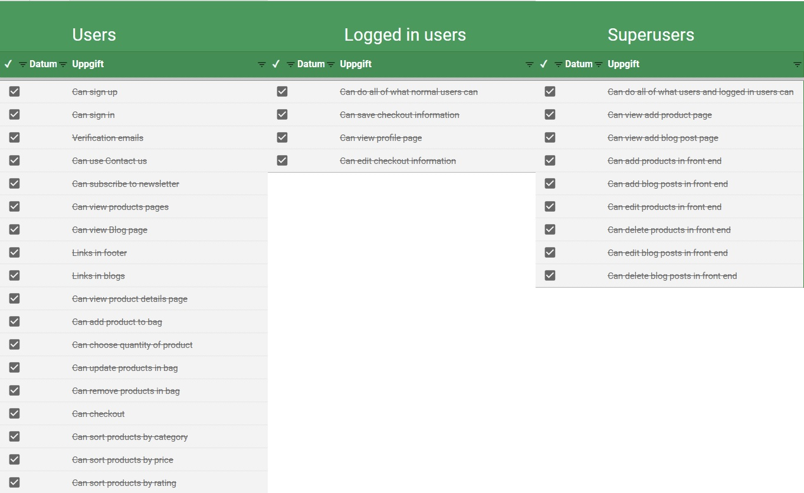
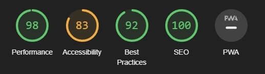
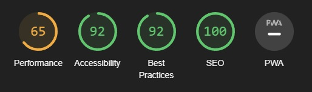

# Testing
### Manual testing:
- I used google sheets to manually test my website:
    

### W3C HTML
- No errors found

### W3C CSS
- No errors found

### PEP8
- No errors found

- Found no crucial errors using flake8 command

### Lighthouse testing:
- Desktop
    
    

- Mobile
    
    
    - On mobile I could enhance the performance by using next-gen formats on images, and think about serving static files with an efficient cache policy.

# Bugs and issues found

- Found an issue noimage.jpeg didn't load - fixed using .png
- Found an issue where webhooks didn't work properly - fixed due to typo in environment variables
- Found an issue where footer don't stick to bottom on profile page - not fixed