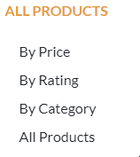
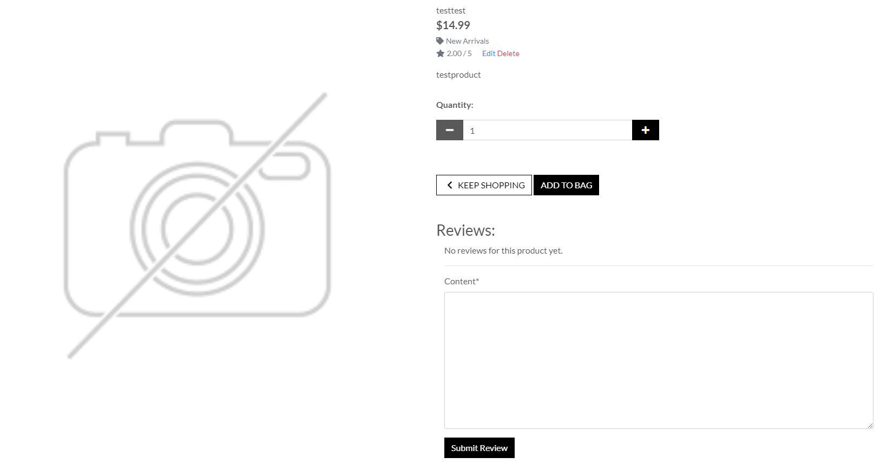

# Testing
### Manual testing:
- I used google sheets to help manually test my website:
    

### Testing through User Stories:
- Product Reviews
    - Date, user and review is showing properly.

    

    - Signed in users can submit a review.

    

    - Not signed in users get this message. And the link to "Sign in" works properly and gets the user to the sign in page.

    

- Contact Us
    - When navigating to Contact Us page the email shows properly if the user is signed in. It's empty if not signed in.

    

    - Sending an email works properly for both signed in and not signed in users, shows in console, get success message:

    

- Newsletters
    - As a user I can sign up for newsletters. Works properly.

    
    

- Admin Front-End Product Management
    - As an admin you have full CRUD functionality in the Front-End. Works properly.
    - Can add a product and images are working properly.

    

    - Can edit/delete products in the Front-End. Works properly.

    

    

    - Owners have a different drop-down list

    

- Owner can add blog posts with CRUD functionality without issues.

    
    

- Verification Emails
    - As a customer, when creating a new account I get a verification email, works properly.

- Page Footer
    - Facebook, Instagram, Twitter and Privacy Policy links works properly.

    

- Edit blog post page
    - Editing and deleting blog post works properly.

    

- Deleting a blog post works properly.

    

- Blog Page
    - Blog page is working properly and as intended for logged in, not logged in and owner.
        - Only the owner can edit/delete blog posts
    
    
    

- Account Information
    - As a customer I can view and edit my account information.

    

    - I can also see my Order History.

    

- Creating a profile.
    - Register for an account works properly.

    
    

- Checkout App
    - Payment information is safe and secure using STRIPE.
    - Confirmation emails are being sent properly after checking out.
    - Webhooks on STRIPE is working properly.

    

    

    

- Navigation
    - Website is easy to navigate through.
    - Website is easy to navigate through on mobile devices.
    - Website has built in back buttons for users to not have to use the back button in browser.

- Shopping Bag
    - As a customer I can view my shopping bag.
    - I can remove items from my shopping bag.
    - I can change quantity of items in my shopping bag.
    - Price, Subtotal and Grand Total is working properly when adding/removing items.
    - Free delivery threshold counting works properly.

    

    - As a user I can view my total shopping bag price from anywhere on the site.

    

- Toasts
    - As a user I get notification messages when for example signing in and out for better user experience.

    

- Password Resets
    - As a signed up user I can reset my password if it gets lost to get my account back, works properly.

- Products App
    - All urls throughout the page is working properly.
    - All links throughout the page is working properly.
    - Categories for products is working properly.

    
    
    

- Login Form
    - Logging in works properly.
    - Logging out works properly.
    - Registering for an account works properly.

- Navigation Bar
    - As a user I can use the navigation bar at the top of the page to browse the site.
    - All pages and dropdown menus is working properly.

    - Desktop view

    

    - Mobile view

    

- Product Details
    - As a user I can click on products to get a more detailed page of that product.
    - Works properly.

    

- Search For Products
    - As a user I can use the search bar to search for products.
    - Works properly.

    

- Loading noimage
    - When product image isn't working properly, a default image is set.

    

- AWS
    - All static files are properly being stored on AWS.

- STRIPE
    - Is working properly.
    - Webhooks are working properly.

### W3C HTML
- No errors found

### W3C CSS
- No errors found

### PEP8
- No errors found

- Found no crucial errors using flake8 command

### JSHint
- No errors found

### Lighthouse testing:
- Desktop
    
    

- Mobile
    
    
    - On mobile I could enhance the performance by using next-gen formats on images, and think about serving static files with an efficient cache policy.

# Bugs and issues found

- Found an issue noimage.jpeg didn't load - fixed using .png
- Found an issue where webhooks didn't work properly - fixed due to typo in environment variables
- Found an issue where footer didn't stick to bottom on profile page - not fixed